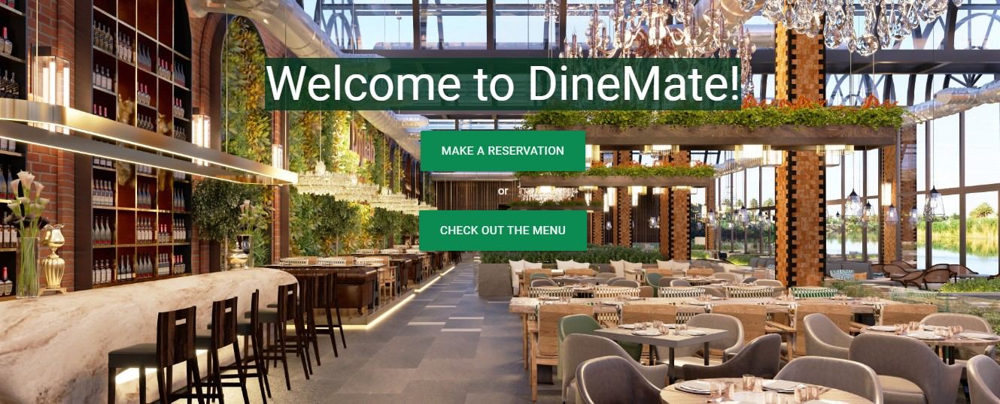
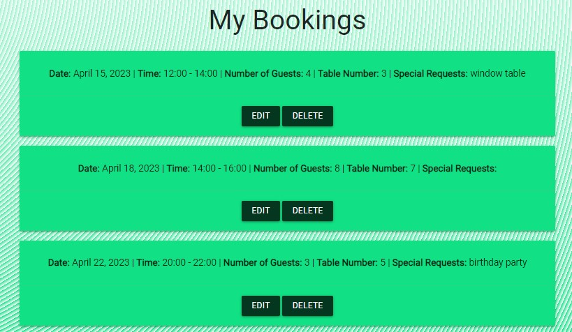

# DineMate

This is a website for a high-end restaurant in Miami, South Beach. It consist of a homepage with a section about the restaurant and a map feature with address and opening times. The website act as a booking platform for the restaurant as well, where customers can book tables at specific dates and times after registering. Customers are also allowed to keep track of their reservations, updating and deleting them as they please.

[The live site can be found here.](https://totes7-dinemate.herokuapp.com/)


---

## Table of Contents

* [User Experience](#user-experience-ux)
  * [User Stories](#user-stories)

* [Design](#design)
  * [Colour Scheme](#colour-scheme)
  * [Typography](#typography)
  * [Imagery](#imagery)
  * [Wireframes](#wireframes)

* [Features](#features)
  * [Existing Features](#existing-features)
  * [Future Implementations](#future-implementations)

* [Technologies Used](#technologies-used)
  * [Languages Used](#languages-used)
  * [Frameworks, Libraries & Programs Used](#frameworks-libraries--programs-used)

* [Deployment & Local Development](#deployment--local-development)
  * [Deployment](#deployment)
  * [Local Development](#local-development)
    * [How to Fork](#how-to-fork)

* [Testing](#testing)

* [Credits](#credits)
  * [Code Used](#code-used)
  * [Content](#content)
  * [Media](#media)
  * [Acknowledgments](#acknowledgments)

## User Experience (UX)

### User Stories

* ### As a customer:

    * As a Site User I want a easy to access navigation bar so that I can easily traverse the website.
    * As a Site User I can create an account so that I can access the website's services.
    * As a SiteUser I can log in/log out with my credentials so that I can securely access my account information and bookings.
    * As a Site User I can view restaurant menu with items prices so that I can see food offered by restaurant prior to my reservation.
    * As a Site User I can view the restaurant's location on a map so that I can easily plan my route.
    * As a Site User I want an intuitive user interface with clear visual cues when entering data into fields on the booking form so that it is easy for me understand and use correctly without confusion or frustration.
    * As a Site User I can select the time and date of my reservation so that I can book a table at the restaurant.
    * As a Site User I can enter the number of guests in my party so that the restaurant knows how many people are coming.
    * As a Site User I can make special requests along with my reservation so that I can make my experience unique and inform the restaurant about possible special occasion like birthdays, anniversaries, etc.
    * As a Site User I can view, change or delete upcoming reservations so that I can easily manage them without contacting the restaurant directly.
    * As a Site User I can read about the Chef so that I can better understand their philosophy and what it's behind the creation of their menu.
    * As a Site User I can contact the reservation website customer service so that I can suggest improvements or report issues and bug with the website itself.

* ### As a restaurant owner:

    * As a Site Admin I can access an admin page so that I can easily see and manage reservations.
    * As a Site Admin I can view existing reservations so that I can inform the customers about any possible issues with their bookings.

## Design

### Colour Scheme

  For this project I started by choosing a vibrant green as the main color, called Caribbean Green 
  (#11e084).
  Then I used [imagecolorpicker.com](https://imagecolorpicker.com/) to find two complementary colors. The result gave me a nice monochromatic triad, in which the two secondary colors are Dark Green (#043620) and Spanish Green (#0b8b52).


### Typography

  The fonts used in this project are Roboto and Nunito, taken from [Google Fonts](https://fonts.google. 
  com/)


### Imagery

  The only two images included in the project are the background image of the homepage, which is just a restaurant main floor, and the chef profile image. The rest of the pages all have the same main bacground wavey pattern using the main color and white.

### Wireframes

  The site design is quite simple, allowing the users to easily access the booking form, their existing reservations and the restaurant menu. The wireframes created to help with the layout are as follows:

  * Homepage 

  

  * Sign Up

  

  * Log In

  

  * Make Booking

  

  * Manage Bookings

  

  * Contact Us Page

  

  ### Differences to Design

  The final design is slightly different from the wireframes. The function to log in and sign up using Google accounts was not implemented, so that button is not present in the final design. The option to choose from different locations for the restaurant was not implemented, so in the booking form and in the manage bookings cards the location slot is not present. The manage your bookings page is also different from the wireframe in the web implementation, with the table design being substituted by the cards like in the mobile wireframe. The conact page is also slightly different in the final design, with the message replaced by a name and email slots.

  ### Database Schema

  The site database schema is based around two models, booking and table. The booking model includes all the required information that the user has to provide in order to make a booking, with the primary key being the booking id. The table model is quite simple, consisting of a table id, table number (primary key) and a table capacity. The two models are connected via the table number, which is reflected in the booking informations once the booking is successfully placed, with the system making sure that the same table is not booked twice at the same time and date.

  


## Features

### Existing Features

* **Navigation Bar**

    * The navigation bar is found on all pages and allows the user to easily navigate to the important parts of the site.
    * It's fixed to the top of the page making it easy to locate, and it's identical on all pages of the site.
    * When the user is not logged in it just shows the two option of loggin in or signin in.
    * On smaller screens, it collapses to a toggler allowing for easy navigation on all devices.


* **Homepage**

    * The homepage consist of three main section.
    * The first section allows the user to quickly access the booking form or check the restaurant menu.

    

    * The second section contains a brief paragraph with the restaurant informations, to give the user a general idea of the restaurant vibe and it's philosophy.

    

    * The third and final section of the homepage contains a brief description of the restaurant's surroundings, with an address and an opening hours cards.
    * In this section the user will also find a live map feature.

    

* **Footer**

    * The footer contains social meadia links that open in a new tab providing easy navigation.
    * The footer also contains the link to the contact page.

    

* **Menu Page**

    * The menu page conatins the full restaurant menu.

    

    * It also includes a chef profile section with a brief introduction to the restaurant Head Chef.

    

* **Make a Booking**

    * The make booking page consist of the booking form.
    * The form is intuitive and easy to fill out.
    * The user is required to input name and email.
    * The user is required to also specify date and time of the reservation using the droopdowns, along with the number of guests.
    * There's also a special requests section, but that is not a requirements and can be left blank.

    

* **My Bookings Page**

    * The MyBookings page contains all reservations made by the user, with relative info.
    * From this page the user is allowed to modify or cancel their bookings.
    * If the user wants to edit their bookings, a page identical to the make a booking page will open with the existing booking details present to allow for easy editing.

    

    * If the user decides to delete a booking, an alert page will open requesting the user to confirm booking deletion to avoid unwanted actions.

    

* **Contact Page**

    * The contact page consist of a simple form that allows the user to get in touch with the restaurant.
    * The user is required to enter their name and email, along with the content of their message.

    

* **Admin Panel**

    * The admin panel allows the owner of the rastaurant to manage the website and the bookings.
    * The owner can easily view all bookings made by useers and modify or delete them.
    * The owner can also add or remove tables from the restaurant to increase or decrease availability.

### Future Implementations

* User can sign in and log in using their social media accounts.
* An email confirmation is sent to the user email upon booking a table successfully.
* An email reminding the user of an upcoming booking is sent to user email on the day of the reservation.

## Technologies Used

### Languages Used

* [HTML5](https://en.wikipedia.org/wiki/HTML5)
* [CSS3](https://en.wikipedia.org/wiki/CSS)
* [JavaScript](https://en.wikipedia.org/wiki/JavaScript)
* [Python](https://en.wikipedia.org/wiki/Python_(programming_language))

### Frameworks, Libraries & Programs Used

* [Django](https://www.djangoproject.com/) is the MVC framework used to create the website.
* [Django Allauth](https://django-allauth.readthedocs.io/en/latest/index.html) has been used to set up user authentication on the site.
* [Materialize](https://materializecss.com/)has been used to assist with the styling of the site and particularly the responsiveness.
* [Heroku](https://www.heroku.com) has been used as the platform to deploy the site.
* [Gunicorn](https://gunicorn.org/) has been used as the server to run Django on Heroku.
* [Cloudinary](https://cloudinary.com/) has been used to store the static and media files for the site.
* [PostgresSQL](https://www.postgresql.org/) has been used as the database for the site.
* [Git](https://git-scm.com/) has been used for version control by using the Gitpod terminal to commit and push code to GitHub.
* [Github](https://github.com/) has been used to store the project's code.


## Deployment & Local Development

### Deployment

The project has been deployed to Heroku. The following steps are used to deploy the site:

* **Creating the Heroku App**
    * On the Heroku dashboard at the top righthand side select the New button and then Create new app.
    * Give the app a name and select the most appropriate location then select create app.
* **Configuring the Heroku App**
    * From the menu at the top of the page select the Resources tab.
    * In the Add-ons box on the resources tab search for Postgres and select Heroku Postgres selecting the free plan before confirming.
    * From the menu at the top of the page select the settings tab.
    * Under Config Vars select Reveal Config Vars. The DATABASE_URL should already be listed.
    * Add a SECRET_KEY and any other required environment variables. For this project this includes CLOUDINARY_URL, EMAIL_HOST_PASS, EMAIL_HOST_USER.
* **Configuring the Django Settings**
    * In the workspace terminal install the Gunicorn web server:
        ```
        pip3 install gunicorn
        ```
    * In the workspace terminal install the libraries required by the database:
        ```
        pip3 install dj_database_url psycopg2
        ```
    * Add the installs to the requirements.txt file
        ```
        pip3 freeze --local > requirements.txt
        ```
    * Create an env.py file in the top level of the directory and add the environment variables to the file.
    * At the top of the django settings file import os and import dj_database_url.
    * At the top of the django settings file add the following if statement to use the env.py file in the development environment:
        ```
        if os.path.isfile('env.py'):
        import env
        ````
    * Replace the databases section in the Django settings file with:
        ```
        DATABASES = {
        'default': dj_database_url.parse(os.environ.get('DATABASE_URL'))
        }
        ```
    * Replace the SECRET_KEY setting in the Django settings file with:
        ```
        SECRET_KEY = os.environ.get('SECRET_KEY')
        ```
    * Migrate the models to the database:
        ```
        python3 manage.py migrate
        ```
    * Any model objects that may have been added to the default database in development will have to be added to the Heroku Postgres database.
    * Create a superuser for the app:
        ```
        python3 manage.py createsuperuser
        ```
    * Add the Heroku Hostname to the ALLOWED_HOSTS setting in the Django settings file:
        ```
        ALLOWED_HOSTS = ['totes7-dinemate.herokuapp.com', 'localhost']
        ```
    * Set DEBUG to False in the Django settings file.
    * Add a Procfile containing the following code in the top level of the directory:
    ```
    web: gunicorn dinemate.wsgi
    ```
    * In the terminal add, commit and push all changes.
* **Deploying the App**
    * In Heroku select the deploy tab from the menu at the top.
    * Select GitHub as the deployment method and browse and connect to the correct repository.
    * Under manual deploy select the main branch and the select deploy branch.

### Local Development

* **How to Fork:**

    * On GitHub navigate to the main page of the repository.
    * The 'Fork' button can be found on the top righthand side of the screen.
    * Click the button to create a copy of the original repository.


## Testing

The project has been validated and manually tested. Details of testing can be found [here](TESTING.md).


## Credits

### Code Used

* The Code Institute **Hello Django** and **I Think Therefore I Blog** walkthroughs were both consulted during the building of this website.
* The alerts classes in CSS for Materialize were taken from [this](https://stackoverflow.com/questions/38156282/create-alert-using-materialize-css) Stackoverflow thread, specifically [this repo](https://github.com/Rinebeck/materialert) from GitHub user Rinebeck.
* The Deployement section of this README.md file was taken from The-Pizza-Oven project by GitHub user [Stephanie-Ash](https://github.com/Stephanie-Ash/the-pizza-oven).

### Media

* The homepage anf chef profile images were taken from [Pexels](https://www.pexels.com/).
* The website mockup image at the top of the README.md file was created on [Am I Responsive?](https://ui.dev/amiresponsive)
* The background css pattern was created using [Magic Pattern](https://www.magicpattern.design/tools/css-backgrounds).
* The icons on the site are from [Font Awsome](https://fontawesome.com/).
* The site favicon was generate using [Favicon.io](https://favicon.io/favicon-generator/)
* The wireframes for the project were created on [Mockplus](https://www.mockplus.com/)
* The database schema was designed on [Dbdiagram.io](https://dbdiagram.io/home)

